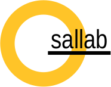

# thesallab.configuration

thesallab.configuration is used by various projects produced by the Sal Lab
, e.g., [PPCode3](https://github.com/zhangyin-github/PPCode3).
## How to build and install
    mvn clean package install
## How to use
Add the following jvm parameters:

    -Dcx.config.file=/path/to/your/configuration/file
On Windows:

    -Dcx.config.file=X:/path/to/your/configuration/file
## License
thesallab.configuration is licensed under the MIT license. But please let us
 know if you use thesallab.configuration in your project by sending an email
  to zhangyin(at)mail.neu.edu.cn
